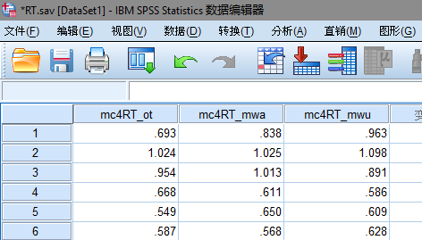

# 摘要
本文介绍如何使用SPSS 20.0做单因素重复测量方差分析。

# 引言
方差分析是通过分析两个及以上分组之间方差的差异，来进行均数之间是否有差异的统计分析。其基本思想是：
- 测量的方差有两个来源：不可控制的随机误差和实验设计引起的系统偏差。
- 如果没有系统误差，则组间不会有显著差异。
- 比较组间均方差和组内均方差可以提示组间误差来自实验设计引起的系统偏差的可能性。  

这篇小文章介绍一下如何SPSS 20.0做单因素重复测量方差分析。用到的数据可以在[这里](poster_ANOVA/RT.sav)下载。
数据来自于一个汉字类别判断实验，记录了被试（N=22） 在三种状态（1.专注，2.走神并没有意识到，3.走神并且意识到）下的平均反应时。在此数据中，自变量为被试的注意状态，因变量为反应时。

# 分析方法和结果
## 用SPSS打开数据
文件”-->"打开"-->“数据”，选择下载的数据，如下图所示，应为21行×3列的数据。  

## 定义变量名称
1. 选择：“分析”-->“一般线性模型”-->“重复测量”;
2. “被试内因子名称：”为自变量名称，填写“report”，或者你希望的名称；“级别数”填写3，按“添加”；
3. “测量名称：”为因变量名称，填写“RT”，按“添加”；  

## 定义变量
接上步，按“定义”，将左边栏中的变量分别引入到“主体内部变量”中  

## 选择分析内容

未完待续。。。
